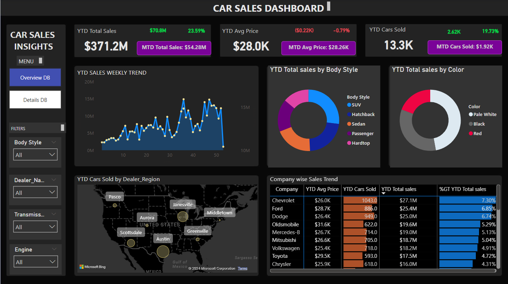

# 🚗📊 Car Sales Insights Dashboard — Power BI

## 📌 Project Overview  
The **Car Sales Insights Dashboard** is a Power BI solution designed to help a car dealership monitor and analyze sales performance in real-time. The dashboard highlights key metrics such as **Year-to-Date (YTD) Sales, Cars Sold, Average Price, and Year-over-Year (YOY) Growth**, enabling data-driven decision-making.

This project demonstrates my expertise in:  
- **Power BI Dashboard Development**  
- **Data Analysis & Business Intelligence (BI)**  
- **Data Modeling & DAX Calculations**  
- **ETL using Power Query and Excel data sources**

---

## 🎯 Project Objective  
To build an **interactive and dynamic Power BI dashboard** provides complete visibility into car sales performance, enabling leadership to:  
- Monitor KPIs in real-time  
- Identify trends & patterns  
- Make data-driven decisions to increase sales

---

## 🚀 Problem Statement  
The dealership required a dashboard that:  

1. Consolidates all sales insights into a single view  
2. Tracks sales performance over time  
3. Identifies sales by category, region, and vehicle attributes  
4. Offers actionable insights on **growth opportunities and business performance**

---

## ✅ KPI Requirements  

The dashboard provides real-time visibility into the following KPI groups:

### **1️⃣ Sales Overview**
- **YTD Total Sales**
- **MTD Total Sales**
- **YOY Growth in Total Sales**
- **Difference vs Previous YTD Sales**

### **2️⃣ Average Price Analysis**
- **YTD Average Price**
- **MTD Average Price**
- **YOY Growth in Price**
- **Difference vs Previous YTD Average Price**

### **3️⃣ Cars Sold Metrics**
- **YTD Cars Sold**
- **MTD Cars Sold**
- **YOY Growth in Cars Sold**
- **Difference vs Previous YTD Cars Sold**

---

## 📊 Visualization Requirements  

The dashboard includes the following analytical visuals:

| Visualization | Purpose |
|--------------|---------|
| **YTD Sales Weekly Trend (Line Chart)** | Identify weekly fluctuations in total sales |
| **YTD Total Sales by Body Style (Pie Chart)** | Compare performance by car body type |
| **YTD Total Sales by Colour (Pie Chart)** | Identify color preferences affecting sales |
| **YTD Cars Sold by Dealer Region (Map Chart)** | Analyze regional sales distribution |
| **Company-wise Sales Trend (Grid)** | Display each company and their YTD sales |
| **Detailed Sales Grid (Table)** | Complete drill-down of every car sale (model, body style, color, region, price, date, etc.) |

---

## 🛠 Tools & Technologies Used  
- 📊 **Power BI Desktop** — Data visualization and modeling  
- 🧮 **DAX (Data Analysis Expressions)** — Measures & calculated columns  
- 🔄 **Power Query** — Data cleaning & transformation  
- 📂 **Excel (.xlsx)** — Raw data source  

---

## ⚙️ Implementation Steps  

1. **Data Import**
   - Connected Power BI to the Excel dataset

2. **Data Cleaning**
   - Removed duplicates
   - Normalized inconsistent values

3. **Data Modeling**
   - Created relationship between fact and dimension tables

4. **Transformation**
   - Used Power Query for shaping data
   - Created a **Date Table** to enable time intelligence

5. **Calculated Columns & Measures**
   - Developed DAX measures for YTD/MTD/YOY calculations

6. **Dashboard Development**
   - Built charts, grid views, and drilled-down tables

---

## 🖥 Dashboard Screenshot  

---

## ✅ Conclusion  
The **Car Sales Insights Dashboard** provides actionable insights into dealership performance by enabling leaders to:  
- Monitor **YTD/MTD/YOY** performance metrics  
- Track trends in models, styles, and regions  
- Identify opportunities to improve sales effectiveness  

With this dashboard, sales performance becomes transparent, measurable, and decision-focused.

---
